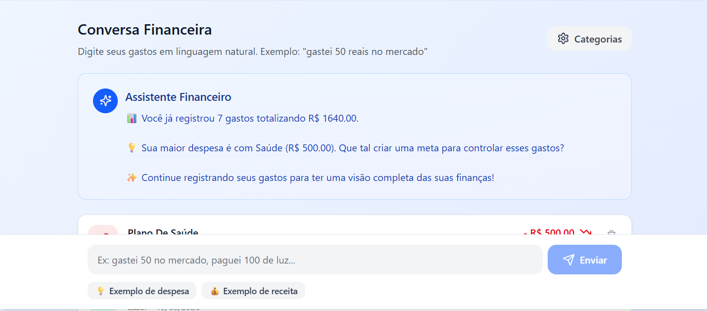

**PRD – App de Organização Financeira com Conversa Natural e Design Universal**

**1. Visão Geral**
Criar um aplicativo de finanças pessoais que funcione por meio de conversas em linguagem natural, simplificando o controle financeiro e tornando-o acessível, intuitivo e inclusivo. O objetivo é oferecer uma experiência acolhedora e democrática, eliminando barreiras como planilhas complexas e interfaces pouco amigáveis.

**2. Problema a Resolver**
Muitos usuários abandonam o controle financeiro por acharem os aplicativos atuais complicados, burocráticos e pouco adaptáveis às suas necessidades. A solução proposta é um app conversacional que entende o usuário, automatiza classificações e fornece recomendações práticas, com acessibilidade integrada desde o protótipo.

**3. Público-Alvo**
- Pessoas que desejam iniciar o controle financeiro sem complexidade.
- Usuários com pouca familiaridade com apps tradicionais.
- Pessoas com diferentes níveis de alfabetização digital.
- Usuários com limitações físicas, visuais ou cognitivas que precisam de acessibilidade.

**4. Funcionalidades-Chave**
1. Registro de gastos via chat: Inserção de despesas em linguagem natural.
2. Classificação automática: NLP para identificar categorias de gastos.
3. Metas financeiras: Criação e acompanhamento de objetivos como economizar determinado valor.
4. Assistente Financeiro: Recomendações personalizadas com base nos hábitos do usuário.
5. Relatórios visuais: Gráficos e dashboards simples, adaptados ao perfil do usuário.
6. Funcionalidades de Design Universal:
   - Interface clara e legível: tipografia simples, contraste adequado e modo escuro.
   - Interação multimodal: chat, comandos de voz e compatibilidade com leitores de tela.
   - Feedback multimodal: confirmações visuais e sonoras opcionais.
   - Flexibilidade de uso: relatórios simples ou detalhados, personalização de metas e ajustes de acessibilidade (tamanho da fonte, contraste).
   - Inclusão cognitiva e cultural: linguagem simples, educativa e contextualizada à realidade brasileira.

**5. Princípios de Design Universal**
- Equidade de uso: todos os usuários podem acessar as mesmas funcionalidades sem barreiras.
- Simplicidade intuitiva: fluxos curtos e diretos, sem burocracia.
- Perceptibilidade da informação: uso de múltiplos canais (visual, auditivo, textual).
- Tolerância a erros: mensagens claras e opções de correção simples.
- Flexibilidade: ajustes de interface e relatórios conforme preferências individuais.

**6. Entregável da IA (MVP)**
- Principais telas: Chat, Metas, Relatórios.
- Recursos técnicos: NLP, categorização automática, motor de recomendações.
- Validação inicial: testes com usuários reais de diferentes perfis (iniciante, pessoa com deficiência, usuário avançado).
- Tom educativo: linguagem acessível em português.
- Aplicação de acessibilidade: inclusão de recursos universais desde o protótipo.

---

## Reflexão

### O que funcionou bem?  
O refinamento do PRD no Copilot facilitou a interação no FIGMA. 

### O que não funcionou como o esperado?  
Usar o Lovable não foi viável, não conseguiu desenvolver o app. Pedindo sugestões de interface, o Copilot sugeriu o FIGMA, que funcionou muito bem, foi bem amigável. 

### O que aprendi sobre conversar com IAs?  
A interação com a IA funciona de forma cumulativa, é melhor partir de ideias simples e ir implementando melhorias e novas ideias, assim a conversa fica mais fluída e é mais difícil da IA alucinar.
